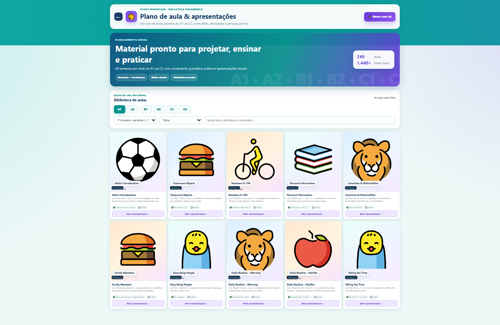

# André Barbosa Santos

### Full Stack Developer | Android Developer | AI Integrations

Desenvolvedor Full Stack com experiência prática na criação de aplicações web e mobile completas, trabalhando desde o frontend e backend até integrações com APIs e Inteligência Artificial.

Tenho experiência desenvolvendo aplicações Android nativas com Kotlin e plataformas web utilizando Next.js, React e Node.js.

Entre meus principais projetos estão uma plataforma completa de aprendizagem de inglês com IA e um aplicativo Android publicado na Google Play.

---

## 🛠 Technologies & Tools

  

### Web Development

`Next.js` `React` `JavaScript` `HTML` `CSS`

### Backend & APIs

`Node.js` `Ktor` `REST APIs` `Supabase` `PostgreSQL` `Firebase` `ASP.NET Core`

### Mobile Development

`Kotlin` `Jetpack Compose` `Retrofit` `Navigation Compose` `Coroutines` `Android SDK`

---

# 🚀 Featured Projects

## 🧠 Study WordFlow

### AI-powered English Learning Platform

Plataforma completa para ensino e aprendizagem de inglês, desenvolvida com tecnologias web modernas e integração com Inteligência Artificial.

🔗 **Live Platform:**  
https://studywordflow.com

 

  

### 🎓 Teaching Platform

A plataforma possui uma área voltada para professores com biblioteca pedagógica completa e materiais organizados por níveis de inglês.

Entre os recursos estão:

- Conteúdo organizado do nível A1 ao C2
- Planos de aula
- Apresentações e slides
- Atividades prontas
- Materiais de vocabulário e gramática
- Geração de conteúdo com Inteligência Artificial

---

### 🤖 AI Learning Experience

O Study WordFlow utiliza Inteligência Artificial para criar experiências interativas de aprendizagem.

Principais funcionalidades:

- Conversação em inglês por voz
- Interação com assistente de IA
- Geração automática de flashcards
- Atividades escritas
- Conteúdo personalizado para aprendizagem
- Sistema de progressão e ranking

 

  

### ⚙️ Development

Projeto desenvolvido trabalhando em diferentes partes da aplicação:

- Frontend
- Backend
- APIs
- Banco de dados
- Autenticação
- Integrações com Inteligência Artificial
- Interfaces responsivas
- Deploy da aplicação

### Technologies

`Next.js` `React` `Node.js` `JavaScript` `REST APIs` `AI APIs`

🌐 **Visit Study WordFlow:**  
https://studywordflow.com

---

# 📱 Top Serviços

Aplicativo Android desenvolvido para conectar clientes a profissionais prestadores de serviços.

O projeto envolve desenvolvimento mobile nativo, integração com backend, autenticação, comunicação com APIs e gerenciamento de solicitações de serviços.

### 📲 Application Preview

  
  &nbsp;
  
  &nbsp;
  

### ✨ Features

- User authentication
- Professional search
- Service request system
- Reviews and ratings
- Backend integration
- API communication
- Native Android interface
- Service professional profiles

### ⚙️ Technologies

`Kotlin` `Jetpack Compose` `Retrofit` `Coroutines` `Firebase` `Android SDK`

🌐 **Website:**  
https://top-servicos-site.web.app/

💻 **GitHub Repository:**  
https://github.com/AndySantt/top-servicos-android

---

# 👨‍💻 About Me

Tenho interesse em oportunidades nas áreas de:

- Full Stack Development
- Backend Development
- Frontend Development
- Android Development
- AI Integrations

Gosto de transformar ideias em aplicações funcionais e tenho experiência prática construindo projetos completos, desde a interface até backend, APIs, banco de dados, integrações e deploy.

---

# 📫 Contact

**LinkedIn:**  
https://www.linkedin.com/in/andr%C3%A9-barbosa-567966400/

**Email:**  
andysant777@gmail.com
